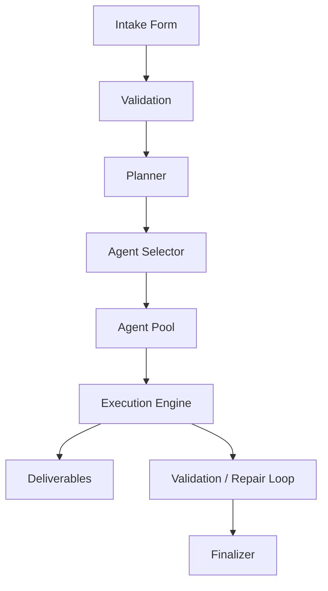

# Task: Produce a Source-Grounded Orchestrator Blueprint / Wiring Diagram

You are being asked to inspect this repository and produce a detailed schematic of how the orchestrator actually works.

This is not a theoretical architecture exercise.

Do **not** invent missing behavior.
Do **not** describe how orchestration systems usually work.
Do **not** fill gaps with assumptions.
Only document what is directly supported by the source code, config files, contracts, prompts, schemas, tests, and runtime artifacts present in this repository.

## Goal

Create a detailed visual and written blueprint of the orchestrator, starting from the user intake form and following the system through:

1. Intake form submission
2. Request normalization and validation
3. Decision-making logic
4. Agent inventory / available agent collection
5. Agent selection logic
6. Task / phase / deliverable planning
7. Agent execution flow
8. Message-passing or A2A contract flow
9. File generation / modification flow
10. Repair / validation / retry flow
11. Final delivery / outcome production
12. Logging, traceability, persistence, and status reporting

The desired visual should feel like a **house wiring diagram, plumbing blueprint, or electrical schematic** for the orchestrator.

It should expose the hidden machinery clearly enough that another engineer could understand how the orchestrator is designed to operate under the covers.

## Required Source-Grounded Behavior

For every node, arrow, decision branch, or process box in the diagram, identify the source file or files that prove it exists.

Use this rule:

> If you cannot cite a file, function, type, schema, prompt, contract, or test proving the behavior, label it as `UNVERIFIED` or omit it.

Do not silently infer missing pieces.

## Primary Questions to Answer

Analyze the repository and answer these questions through diagrams and concise notes:

### 1. Intake Layer

* What form, API endpoint, CLI entrypoint, or UI component starts orchestration?
* What fields are accepted?
* Which fields are required?
* Where is the intake payload validated?
* What internal object or type does the intake become?

### 2. Orchestration Initialization

* What function starts the orchestration run?
* What state object is created?
* What IDs, timestamps, paths, or run metadata are generated?
* Where is the run stored?
* What configuration is loaded?

### 3. Agent Inventory

Identify all agents the orchestrator knows about.

For each agent, document:

* Agent name
* Role / purpose
* Prompt source
* Input contract
* Output contract
* Expected deliverables
* Files that define or reference it
* Whether the agent is always used or conditionally selected

### 4. Agent Selection Logic

Document how the orchestrator decides which agents to use.

Include:

* Selection functions
* Routing rules
* Role matching
* Phase matching
* Task-to-agent assignment
* Fallback behavior
* Any hardcoded agent names
* Any dynamic discovery behavior
* Any model-selection or provider-selection behavior

If the selection logic is incomplete, fragile, hardcoded, or unclear, document that directly.

### 5. Phase and Task Flow

Map the full execution flow.

Show:

* Phases
* Tasks within phases
* Gates between phases
* Success/failure conditions
* Validation steps
* Retry behavior
* Repair-loop behavior
* Finalization behavior

Represent this as both:

1. A high-level system diagram
2. A detailed sequence diagram

### 6. A2A / Contract Flow

Document how agents communicate with the orchestrator and with each other.

Include:

* Message shape
* Contract types
* Required response format
* Deliverable format
* File block extraction rules
* Status reporting
* Validation of agent responses
* Known failure modes where agents produce prose instead of files
* Any explicit governance contract logic

### 7. File and Deliverable Flow

Diagram the flow of files through the system.

Include:

* Where generated files are expected to appear
* How file blocks are parsed
* How files are written
* How existing files are handled
* How edits are detected
* How deliverables are collected
* How the final output is assembled
* How missing files are handled

### 8. Validation and Repair

Document all validation and repair mechanisms.

Include:

* TypeScript validation
* Build validation
* Test validation
* Contract validation
* File extraction validation
* Repair task generation
* Repair agent routing
* Retry limits
* Failure states
* Escalation or finalizer behavior

### 9. Runtime State and Traceability

Document:

* Run state files
* Logs
* Trace files
* Status updates
* Phase completion markers
* Agent response records
* Error records
* Final report generation

Explain how someone could audit a run after completion.

### 10. Expected Outcome

Based on the actual design, describe what the orchestrator is expected to produce.

Include:

* Expected final artifacts
* Expected success state
* Expected warning state
* Expected failure state
* What “done” means in code
* What the user should receive at the end

## Required Visual Outputs

Create the following diagrams using Mermaid unless the project already uses another diagramming standard.

### A. System Blueprint Diagram

A full top-down architecture diagram showing the orchestrator as connected subsystems.

Suggested style:



Do not use the example above as fact. Replace it with the actual design found in the repository.

### B. Intake-to-Outcome Sequence Diagram

Show the actual lifecycle of one orchestration run from request submission to final result.

Use Mermaid sequence syntax.

### C. Agent Routing Matrix

Create a table showing:

| Phase | Task Type | Agent Used | Selection Rule | Input | Expected Output | Source Evidence |
| ----- | --------- | ---------- | -------------- | ----- | --------------- | --------------- |

### D. Agent Inventory Map

Create a diagram or table of every available agent.

| Agent | Role | Defined In | Prompt Source | Contract | Used When | Output |
| ----- | ---- | ---------- | ------------- | -------- | --------- | ------ |

### E. Decision Tree

Create a decision tree showing how the orchestrator branches.

Include:

* Agent selection branches
* Validation branches
* Retry / repair branches
* Success / failure branches

### F. File / Deliverable Plumbing Diagram

Create a diagram showing how content moves from:

`Agent Response → File Block Extraction → Write Operation → Validation → Final Deliverable`

Only include stages that exist in the code.

### G. Repair Loop Diagram

Create a specific diagram for repair flow.

Include:

* What triggers repair
* Which agent receives repair work
* What prompt is generated
* What output format is required
* What happens when repair fails

## Required Written Outputs

Create a markdown document at:

```text
docs/orchestrator-blueprint.md
```

The document must include:

1. Executive summary
2. Source map
3. System blueprint
4. Intake flow
5. Agent inventory
6. Agent selection logic
7. Phase/task execution flow
8. A2A / governance contract flow
9. File and deliverable flow
10. Validation and repair flow
11. Runtime state and traceability
12. Expected outcomes
13. Known gaps / unverified behavior
14. Risk areas
15. Recommended next hardening steps

## Source Evidence Requirement

For each major claim, cite the exact source location.

Use this format:

```text
Evidence: backend/src/execution.ts → functionName()
Evidence: backend/src/governance-contracts.ts → InterfaceName
Evidence: backend/src/path/to/file.ts → lines or symbol name
```

If exact line numbers are available, include them.

## Anti-Hallucination Rules

You must maintain a section titled:

```markdown
## Unverified or Inferred Areas
```

Anything not directly proven by source must go there.

Use these labels:

* `VERIFIED` — directly supported by code or config
* `PARTIALLY VERIFIED` — supported, but incomplete or spread across files
* `INFERRED` — reasonable interpretation, but not directly explicit
* `UNVERIFIED` — not proven by source

Do not present `INFERRED` or `UNVERIFIED` content as system fact.

## Repository Inspection Instructions

Before writing the final document:

1. Search the repository for orchestration entrypoints.
2. Search for intake form fields and submit handlers.
3. Search for agent definitions.
4. Search for prompt templates.
5. Search for A2A, governance, contract, deliverable, and response schemas.
6. Search for execution engine files.
7. Search for file block parsing / extraction logic.
8. Search for validation logic.
9. Search for repair-loop logic.
10. Search for finalizer / summary / report generation logic.
11. Search for run-state and traceability files.

Suggested search terms:

```text
orchestrate
execution
agent
agents
planner
phase
task
deliverable
governance
contract
a2a
repair
retry
validate
validation
finalize
finalizer
intake
form
submit
file block
extract
writeFile
state
run
trace
status
model
route
routing
```

Use `rg` if available. If `rg` is not available, use the repository’s available search tooling.

## Deliverable Quality Bar

The final document should make the orchestrator understandable as a mechanical system.

A reader should be able to answer:

* Where does the request enter?
* What does the orchestrator do first?
* What agents are available?
* How does it choose agents?
* What does each agent receive?
* What must each agent return?
* How are files extracted and written?
* How is success validated?
* What happens when validation fails?
* What does the final result contain?
* Which parts are hardcoded?
* Which parts are configurable?
* Which parts are fragile?
* Which parts are not yet proven by source?

## Optional but Preferred

Also create:

```text
docs/orchestrator-blueprint.mmd
docs/orchestrator-sequence.mmd
docs/agent-routing-matrix.md
docs/orchestrator-risk-map.md
```

The `.mmd` files should contain standalone Mermaid diagrams that can be rendered independently.

## Final Response

When finished, report:

1. Files created or modified
2. Key diagrams included
3. Biggest verified design findings
4. Biggest gaps or uncertain areas
5. Any source files that were especially important
6. Any places where the code contradicts the intended design

Do not claim the blueprint is complete unless every major flow is backed by source evidence.
